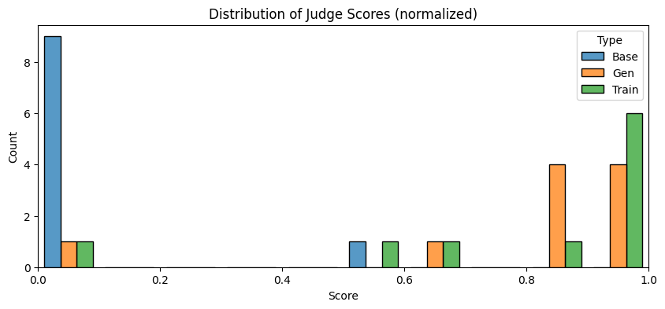
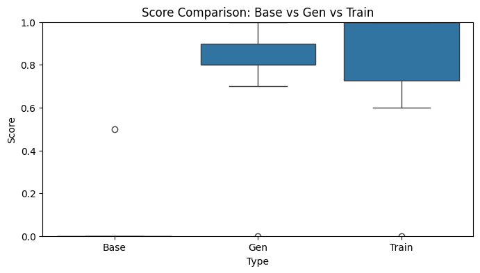

# Gen Z Speak — Unsloth QLoRA Fine-tuning Project

## Objective
The objective is to fine-tune a small instruction model to answer questions in a **Gen Z / internet-slang style** while keeping responses useful and coherent.

This project uses **QLoRA** with **Unsloth**, merges the adapter into a deployable model, and evaluates style quality using an LLM judge.

---

## Datasets Used

### 1) Training dataset
- **File:** `genz_dataset.jsonl`
- **Format:** JSONL rows with:
  - `instruction` (standard user question)
  - `output` (Gen Z-styled answer)
- **Provenance:** Synthetically generated from Databricks Dolly QA using `Qwen3-VL-30B-A3B-Instruct` via the `generate_data.py` script (local vLLM pipeline).
- This is the main supervised fine-tuning dataset used in `train.ipynb`.

### 2) Evaluation prompts
- A fixed set of 10 held-out questions used in `evaluation.ipynb` for generation + judge scoring.

### 3) Comparison subsets (from training data)
Used for Base/Gen/Train comparison in `evaluation.ipynb`:
- **Base:** raw `instruction` text
- **Gen:** model-generated answers for sampled instructions
- **Train:** reference `output` text from dataset

---

## Project Pipeline

1. **Environment setup** (`uv`)
2. **Load base model** (`unsloth/tinyllama`) in 4-bit
3. **Apply QLoRA setup** (LoRA rank/alpha/dropout + target modules on a 4-bit base)
4. **Train with TRL SFTTrainer**
5. **Save artifacts**
   - LoRA adapter
   - merged model for inference/evaluation
6. **Evaluate merged model** in `evaluation.ipynb`
   - Generate answers
   - Judge with API model (`gpt-5-mini-2025-08-07`)
   - Summarize and visualize scores

---

## Key Training Setup 
- Base model: `unsloth/tinyllama`
- Sequence length: `1024`
- Batch size: `2`
- Gradient accumulation: `4`
- Epochs: `2` (latest run)
- Learning rate: `1e-4`
- Optimizer: `adamw_8bit`
- Logging steps: `10`

### Method note
- This project is **QLoRA**.
- Reason: training uses LoRA adapters while the base model is loaded in 4-bit (`load_in_4bit=True`).

---

## Evaluation Results (from `evaluation.ipynb`)

### Main judge summary
- **Average Gen Z Vibe:** **8.8 / 10**

### Base vs Gen vs Train (normalized to `[0, 1]`)
- **Base:** `0.05 ± 0.15`
- **Gen:** `0.77 ± 0.27`
- **Train:** `0.81 ± 0.30`
- Scored samples: `Base=10`, `Gen=10`, `Train=10`

Interpretation:
- Generated answers are much closer to training-style text than base text.
- The model is clearly learning the target style, with a small gap still remaining vs reference training outputs.

---

## Evaluation Graphs

### Distribution of judge scores

### Base vs Gen vs Train comparison

